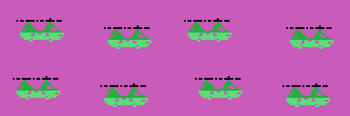

# Findings

What turns up when you take it apart and cannot be seen while playing. Each one
with its address.

## The fourth era is 1984, not 1982

The five years the scoreboard paints are at 0x4E7C, four characters each:
**1910, 1940, 1970, 1984 and 2001**. In the arcade that fourth era is 1982, the
year of the original; this conversion changed it. The cartridge itself, on the
other hand, signs ©KONAMI 1983, so the year you see on the game screen is later
than the one you see on the title screen.


## The attract mode flies by reading the cartridge itself

When the game is left alone, the "joystick" does not come from any number
generator. `MANDO_DE_LA_DEMO` (0x546B) does this:

```
	ld hl,05399h      ; the plane's own routine
	ld a,r            ; the memory refresh register
	call SUMA_A_HL
	ld a,(hl)
	ld (0e009h),a     ; and that is the controller
```

So the attract mode flies by reading the very program that is flying it. Since
the R register advances with every instruction, the byte that comes out is
different every time, and since the code is not random, the plane draws turns
that look deliberate without being so.

## The shots are characters that look before they write

The MSX can only show four sprites on a line, so Time Pilot keeps the sprites
for the planes and draws the eight shots **in the name table**. Each slot is
four bytes at 0xE230: the cell, the direction of flight and the character.

Before painting itself, each shot **reads** the cell it is heading for (0x557B):
it sets the address up for reading, looks at what is there, and only writes if
what it finds is sky. That way they neither overwrite each other nor cover the
scenery, and erasing means writing the sky character back.

The end-of-era big machine does the same, six characters wide by four tall.

## The plane does not move: it turns

The controls say which of the sixteen directions you want (table at 0x545B), and
the plane turns **one step at a time** until it gets there, always the short way
round: if the difference is more than eight, it turns the other way (0x53CE).


Each direction has its own 32 bytes of artwork at 0x6F2B, but there is only one
in video memory: as soon as the direction changes, the right 32 bytes are
uploaded to the same place (0x53E3). One sprite, sixteen drawings and a single
slot.

And the plane has **neither slot nor coordinates**: it is nailed at Y = 0x5C,
X = 0x54 (0x5408). In this game the one who does not move is the player.

## Why the helicopters do not turn

In era 3 the enemies never turn around, and it is not a design decision: there
are **no drawings**. Each era uploads its own sprite patterns, and the biplane
(0x73F4), the fighter (0x74F4) and the jet (0x7652) each bring eight rotations
of 32 bytes; the helicopter (0x75F2) brings **96 bytes, three drawings**.

The five lists from 0x68DC to 0x6909 say which behaviours can turn up in each
era, and era 3 gets exactly 5, 6 and 7, which are the only three that do not
turn: one goes horizontally, another goes in a wave, and the third turns side-on
for one stretch and faces front for the rest (0x620D uses drawings 0x24 and
0x28). The behaviours are handed out per era according to the drawings there are.

The era 5 saucer is the other extreme: **a single drawing**, which 0x45BB
uploads eight times over to fill the eight pattern slots.

## The enemy's wave is tabulated, and it closes

Behaviour 6 does not work out any curve: it reads it from 64 pairs at 0x6322,
each one with how much is added to Y and how much to X. Added up, the Ys come to
**exactly zero** —the first 32 steps come down 51 pixels and the next 32 are
their mirror— so the thing always comes back to the height it entered at while
advancing 106 pixels. Bit 0 of its state decides whether the wave goes right or
left.

Behaviour 8 has two tables of sixteen stretches and the R register tosses a coin:
the one at 0x62E2 adds up to +8 of turn, a full circle in 216 frames, and the one
at 0x6302 adds up to −6 in 424, so it never closes the circle.

## Each era's big machine ends exactly where the scoreboard starts

The five blocks from 0x6BF2 on are not scenery: they are **the drawings of the
big machine**, one per era, uploaded to VRAM 0x2340 with three shifted copies
beside them so it can move in two-pixel steps. The arithmetic works out to the
byte: five strips of four characters with their copies are 760 bytes, and
0x2340 + 760 = 0x2638, which is exactly where `CARGA_MARCADOR` (0x45E9) puts the
digits.



## The interrupt splits its work over six frames

0xE01F counts from 0 to 5 and the table at 0x4118 says what is due on each one:
the shots and the plane, the background, the big machine, and the enemies three
times out of six. And on the way out the VDP status is read again: if another
interrupt has arrived meanwhile, it takes one more step without leaving (0x410B).

Measured in the emulator over a real game, that split comes out even —from 8.8
to 11.1 milliseconds per phase— and the interrupt eats **exactly half** the
frame. The numbers are in [In the emulator](IN-THE-EMULATOR.html).

## The same letters, twice in VRAM and once in the cartridge

The bytes from 0x798B on are uploaded **twice**: once as the end of the menu
character block (0x4272) and once as the start of the font (0x427A). The same
happens with the digits at 0x79D3 (0x45E9).


In SCREEN 2 colour goes per character, so the only way to have the same alphabet
in two colours is to have it under two character numbers. Time Pilot manages it
without storing the drawings twice: it uploads the same bytes to two places.

## Silence is an empty sound program

To shut channel 2 up at once, 0x5C8F touches neither the PSG nor any flag: it
points the pointer at the **0xFF that closes** the program at 0x7E40. The channel
reads that 0xFF on the next step, goes quiet and switches itself off, the usual
way.

## The background characters are stored once and uploaded shifted

`SUBE_CARACTERES_GIRADOS` (0x4B81) takes a block of characters, uploads it to
VRAM and then repeats the block **shifted two or four pixels to the left**, as
many times as 0xE00A says. The bits that come out of one byte go into the one
for the character next door (0x4BC0). That way the scenery can move in two-pixel
steps without touching the name table and without storing more drawings.

## Why the trick of firing while spinning works

Each shot takes with it the direction the plane was flying in when it left:
0x54EC copies it from 0xE146 into the slot, and from then on the shot carries on
by itself (0x5570 on). There is no routine that ever re-aims them.

That is why turning without letting go of the button leaves you surrounded by
shots fanning out: eight fit at a time, each with its own course, and with the
controls you can chain them four at a time (0x54E8), rearming the count as you
let go. The cartridge does not reward that way of playing anywhere; it falls out
of the direction being copied once and never touched again.

## The game's numbers

- **Lives**: two per player, and one more at 10,000 points and then every 50,000
  (0x48F0). The step is kept in the high digits of the score and goes up by five
  each time.
- **Enemies per round**: 25 the first one, and five more every five rounds up to
  a ceiling of 50 (0x48A5). The live count is at 0xE120, and when the big machine
  comes out it is left at 5 (0x56F3).
- **Points**: 50 for an enemy, 500 for one of the era's own, 500 for picking up
  the passenger and 500 for the big machine, which takes **twenty-four hits**
  (0x5CF5).
- **Shots**: eight at a time at most, and no more than four in a row with the
  controls (0x54E8); the attract mode fires all the time.
- **The wait is not counted in frames**: 0xE018 is counted down by the interrupt
  once every 32 frames (0x40F5), so one point of wait is 0.64 seconds. The
  sixteen points asked for at the start of a life are about ten seconds.

## This cartridge does not carry Konami's hidden mark

Other cartridges from the same house hide their catalogue number and their title
in katakana at the end of the ROM, a detail documented by **Manuel Pazos**. There
is nothing here: the last byte with any content is the 0xFF that closes the sound
program at 0x7EED, at 0x7F1D, and from 0x7F1E to 0x7FFF there are 226 bytes of
padding, all 0xFF.

## A `ret` nobody reaches

At 0x6012 there is a loose 0xC9 byte between the last of the enemy shot steps and
the routine at 0x6013. No instruction in the listing jumps there and no pointer
lands there. There is another one just like it at 0x415F, behind the `jp (hl)` at
0x415E.
