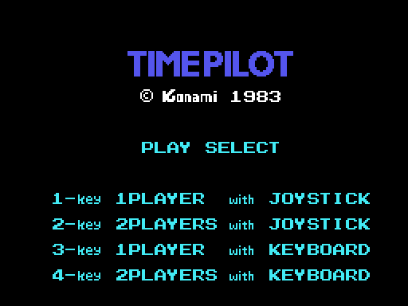
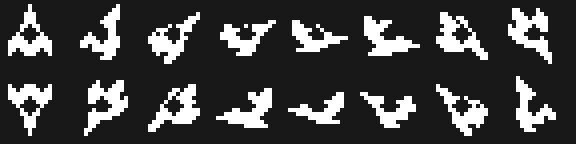

# El juego

Un avión en medio de la pantalla, dieciséis direcciones, enemigos que vienen de
todas partes y, cuando has derribado los que hacían falta, un bicho enorme al
que hay que tumbar para saltar a otra época. Todo lo que hay en esta página sale
de leer el código que lo hace.

## La pantalla de título

El cartucho firma **©KONAMI 1983** dos veces con su propia fuente: bajo el
título y al pie del marcador. Debajo, PLAY SELECT y cuatro opciones, que son
cuatro listas de rótulos seguidas (0x4EE8 y siguientes): uno o dos jugadores,
con joystick o con teclado. La tecla que se pulse decide las dos cosas a la vez
(0x438E), y 0xE007 se queda con el mando elegido.

Si no se toca nada, arranca la demo. Y la demo no lleva un guión grabado: el
"joystick" sale de leer **el propio código del cartucho**, con el registro R
como azar. Está contado en [Hallazgos](HALLAZGOS.html).

## Las cinco épocas

El marcador pinta el año de la época que toca, cuatro caracteres sacados de la
tabla de 0x4E7C:

| época | año |
|---|---|
| 1 | 1910 |
| 2 | 1940 |
| 3 | 1970 |
| 4 | **1984** |
| 5 | 2001 |

Cada época trae su propio juego de caracteres (0x73F4 y siguientes), sus
decorados (0x6BF2 y siguientes) y su lista de colores (0x4D39 y siguientes), que
es lo que le cambia el color al cielo. Al pasar de la 5 se vuelve a la 1
(0x489D).

## El avión

El mando no mueve el avión: le dice **hacia dónde tiene que mirar**. La tabla de
0x545B convierte el nibble del joystick en una de las dieciséis direcciones —la
0 es arriba, la 4 la derecha, la 8 abajo y la 12 la izquierda—, y el avión va
girando un paso cada vez hasta llegar, siempre por el lado corto (0x53CE).

Cada dirección tiene sus 32 bytes de dibujo en 0x6F2B, y en la memoria de vídeo
solo hay uno: el que toca, que se sube en cuanto el avión gira (0x53E3). Lo que
se mueve es el fondo, que se desplaza en la dirección contraria (0x4FE9), y las
nueve nubes, que son caracteres de la tabla de nombres y dan la vuelta al llegar
al borde.

## Los disparos

Con el botón salen hasta **ocho disparos a la vez**, cada uno con su ficha de
cuatro bytes en 0xE230: la casilla de la tabla de nombres, la dirección en la
que vuela y el carácter que lo dibuja. La tabla de 0x54F6 dice por qué casilla
sale cada uno según la dirección del avión.

No son sprites. Cada fotograma se borran de su casilla, se calcula la siguiente
—una rutina por dirección, en 0x5570 y siguientes— y se vuelven a pintar; y
antes de pintarse **leen** lo que hay en la casilla (0x557B): si no es cielo, el
disparo no se dibuja. Con el mando se pueden encadenar cuatro seguidos (0x54E8);
la demo dispara siempre.

## Los enemigos

Siete fichas de diez bytes en 0xE2D0, con **ocho comportamientos** distintos
(tabla de 0x605C). Todos acaban llamando al mismo movedor; lo que cambia es cómo
eligen la dirección y cada cuánto la cambian: unos van al azar, otros apuntan al
centro de la pantalla —que es donde está siempre el avión— y otros se paran a
disparar. La rutina de 0x5AB5 es la que dice, para una posición cualquiera, cuál
de las ocho direcciones lleva al centro.

Además hay cuatro fichas propias de la época en 0xE260 (época 1) o 0xE2A0 (de la
3 en adelante), y de la época 3 en adelante salen dos enemigos más cada ocho
pasos (0x5BAE).

Derribar un enemigo son **50 puntos**; los de la época, **500**; y recoger al
pasajero, otros 500.

## El bicho grande

Cuando ya no queda ninguno de los enemigos que hacían falta, sale el bicho
grande (0x6540). Tampoco es un sprite: son **seis caracteres de ancho por cuatro
de alto** pintados en la tabla de nombres (0x69C5), que se borran y se vuelven a
pintar cada vez que se mueve. Aguanta **veinticuatro impactos** (0x5CF5), vale
500 puntos y, al caer, se lleva por delante todo lo que hubiera en pantalla
(0x5DE1). Si se sale por el borde sin que lo derriben, la fase se da por
terminada igual.

## Vidas, rondas y puntos

Dos vidas por jugador (0x443E) y una más a los **10.000 puntos**, y luego cada
**50.000** (0x48F0). Los puntos son tres bytes BCD, seis cifras, y se pintan
sumándole 0xE5 a cada una, que es donde empiezan las cifras en el juego de
caracteres.

Los enemigos que hay que derribar para que salga el bicho grande empiezan en
**25** y suben de cinco en cinco cada cinco rondas, hasta un tope de **50**
(0x48A5). Con dos jugadores, cada uno lleva su época, su ronda y su cuenta, y se
turnan al perder una vida (0x4AB3).
