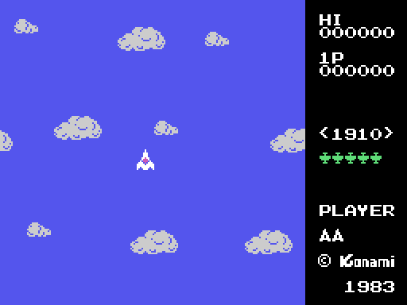
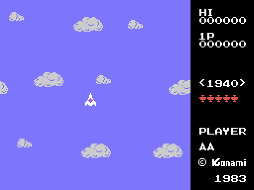
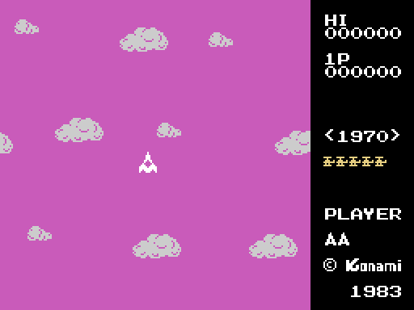
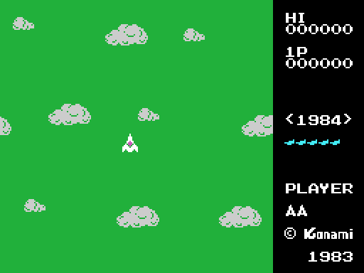
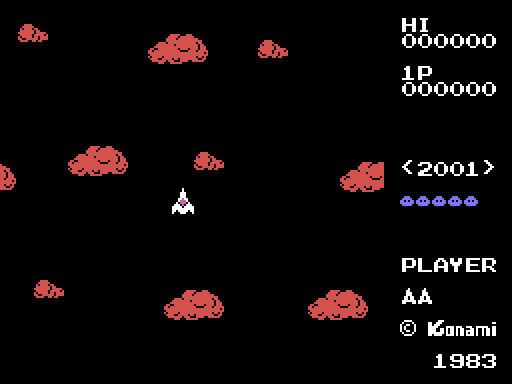
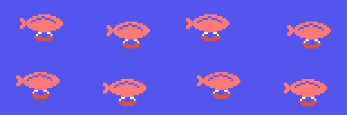
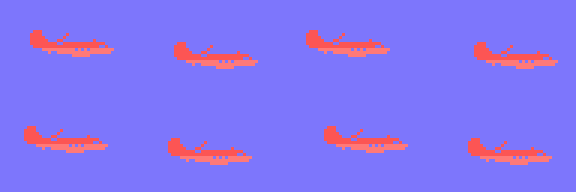
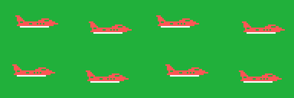
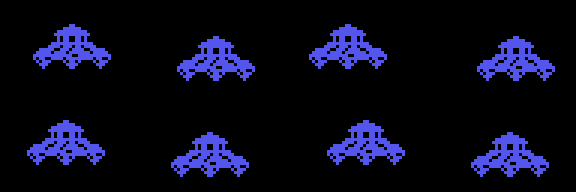

# El juego

Un avión en medio de la pantalla, dieciséis direcciones, enemigos que vienen de
todas partes y, cuando has derribado los que hacían falta, un bicho enorme al
que hay que tumbar para saltar a otra época. Todo lo que hay en esta página sale
de leer el código que lo hace.

## La pantalla de título

El cartucho firma **©KONAMI 1983** dos veces con su propia fuente: bajo el
título y al pie del marcador. Debajo, PLAY SELECT y cuatro opciones, que son
cuatro listas de rótulos seguidas (0x4EE8 y siguientes): uno o dos jugadores,
con joystick o con teclado. La tecla que se pulse decide las dos cosas a la vez
(0x438E), y 0xE007 se queda con el mando elegido.

Si no se toca nada, arranca la demo. Y la demo no lleva un guión grabado: el
"joystick" sale de leer **el propio código del cartucho**, con el registro R
como azar. Está contado en [Hallazgos](HALLAZGOS.html).

## La pantalla de partida

El área de juego son las **24 primeras columnas**; de la 25 en adelante va el
marcador, que se pinta de una sola lista de rótulos (0x4FA3) y luego se rellena
por trozos: los seis ceros de cada jugador, el año de la época entre corchetes
(0x44A3) y, debajo de PLAYER, las vidas que quedan, dibujadas con la navecita
del carácter 9 (0x46F7). La fila de marcas verdes son **los enemigos que
faltan** para que salga el bicho: cada marca vale por cinco (0x4763), y el
dibujo de la marca cambia con la época (0x6AD0 y siguientes).

Esa imagen no es una captura: se ha montado repitiendo fuera del cartucho las
mismas subidas a la memoria de vídeo y las mismas listas de rótulos que hace él.

## Las cinco épocas

El marcador pinta el año de la época que toca, cuatro caracteres sacados de la
tabla de 0x4E7C:

| época | año | lo que sale enfrente |
|---|---|---|
| 1 | 1910 | biplanos |
| 2 | 1940 | cazas de hélice |
| 3 | 1970 | helicópteros |
| 4 | **1984** | reactores |
| 5 | 2001 | platillos |

Cada época trae tres cosas suyas: los **patrones de sprite** de sus enemigos
(0x73F4 y siguientes), el **bicho grande** con el que termina (0x6BF2 y
siguientes) y la **lista de colores** del cielo (0x4D39 y siguientes). Al pasar
de la 5 se vuelve a la 1 (0x489D).

Y cada una tiene su cielo, que es lo primero que se nota: la 1 y la 2 en dos
azules distintos, la 3 magenta, la 4 verde y la 5 negra con las nubes en rojo.
Eso son las listas de color de 0x4D39 en adelante, y las cinco pantallas salen
de repetirlas fuera del cartucho:

Lo que no cambia es el decorado: las nubes son siempre las mismas (0x6AF8), y
las sube INIT una vez para las dos pantallas; la partida no las recarga.

## El avión

El mando no mueve el avión: le dice **hacia dónde tiene que mirar**. La tabla de
0x545B convierte el nibble del joystick en una de las dieciséis direcciones —la
0 es arriba, la 4 la derecha, la 8 abajo y la 12 la izquierda—, y el avión va
girando un paso cada vez hasta llegar, siempre por el lado corto (0x53CE).

Cada dirección tiene sus 32 bytes de dibujo en 0x6F2B, y en la memoria de vídeo
solo hay uno: el que toca, que se sube en cuanto el avión gira (0x53E3). El
avión no tiene ficha ni coordenadas: está clavado en Y = 0x5C, X = 0x54
(0x5408). Lo que se mueve es todo lo demás: el fondo se desplaza en la dirección
contraria (0x4FE9), y las nueve nubes, que son caracteres de la tabla de
nombres, dan la vuelta al llegar al borde.

## Los disparos

Con el botón salen hasta **ocho disparos a la vez**, cada uno con su ficha de
cuatro bytes en 0xE230: la casilla de la tabla de nombres, la dirección en la
que vuela y el carácter que lo dibuja. La tabla de 0x54F6 dice por qué casilla
sale cada uno según la dirección del avión.

No son sprites. Cada fotograma se borran de su casilla, se calcula la siguiente
—una rutina por dirección, en 0x5570 y siguientes— y se vuelven a pintar; y
antes de pintarse **leen** lo que hay en la casilla (0x557B): si no es cielo, el
disparo no se dibuja. Con el mando se pueden encadenar cuatro seguidos (0x54E8),
y la cuenta se rearma al soltar el botón; la demo dispara siempre.

Cada disparo se lleva puesta la dirección en la que vuela el avión en el momento
de salir (0xE146, leída en 0x54EC) y no la cambia nunca más. De ahí que funcione
el truco de disparar dando vueltas: los ocho salen por casillas distintas y cada
uno sigue por su lado, así que con el avión girando entero se acaba rodeado de
disparos que se van abriendo. No hay nada en el cartucho que premie eso: sale
solo de que la dirección se copie una vez y se quede ahí.

## Los enemigos

Siete fichas de **dieciséis bytes** en 0xE2D0. Cada ficha lleva su estado, cuál
de los **ocho comportamientos** le toca (tabla de 0x605C), una cuenta atrás
hasta el siguiente cambio y lo que ese comportamiento necesite. Todos acaban
llamando al mismo movedor; lo que cambia es cómo eligen la dirección y cada
cuánto la cambian:

| | qué hace | dónde |
|---|---|---|
| 1 | cambia de rumbo al azar cuando se le acaba la cuenta | 0x6087 |
| 2 | apunta al centro de la pantalla cada vez que se le acaba la cuenta | 0x60C5 |
| 3 | espera, apunta al centro y dispara: 126 fotogramas entre disparo y disparo | 0x60F8 |
| 4 | la misma máquina que el 3, pero con 53 fotogramas de descanso, y 32 en la época 4 | 0x612C |
| 5 | solo se mueve en horizontal, un píxel por fotograma | 0x6186 |
| 6 | va en onda, con los 64 pasos tabulados de 0x6322 | 0x61B2 |
| 7 | por tramos de 32 fotogramas; en el segundo se pone de perfil | 0x61F1 |
| 8 | trayectoria tabulada: dieciséis tramos de (cuánto dura, hacia dónde gira) | 0x629C |

La rutina de 0x5AB5 es la que dice, para una posición cualquiera, cuál de las
ocho direcciones lleva al centro de la pantalla, que es donde está siempre el
avión.

**Qué comportamiento sale en cada época** lo dicen cinco listas de ocho entradas
(0x68DC a 0x6909), una por época. Al sacar un enemigo, 0x6679 coge una de las
ocho **al azar con el registro R**, así que las repeticiones de la lista son la
probabilidad:

| época | comportamientos que pueden salir |
|---|---|
| 1 | 8, 2 y 1 |
| 2 | 8, 3, 4 y 2 |
| 3 | 5, 6 y 7 |
| 4 | 4 la mitad de las veces; 2 y 3 el resto |
| 5 | 1, 2, 4, 6 y 8 |

La época 3 es la rara, y tiene explicación: **el helicóptero es el único enemigo
que no tiene ocho rotaciones**. Su bloque de patrones son 96 bytes, tres dibujos
(0x75F2), mientras que el biplano, el caza y el reactor traen ocho cada uno. Y
los tres comportamientos de esa época —5, 6 y 7— son justo los tres que no
giran: el 5 va en horizontal, el 6 en onda y el 7 se pone de perfil en un tramo
y de frente en los demás. Sin dibujos no hay giro.

El platillo de la época 5 va al otro extremo: **un solo dibujo de 32 bytes**,
que 0x45BB sube ocho veces seguidas para llenar los ocho huecos de patrón.

## Lo que sueltan

| dónde | qué es | cuántos | quién lo suelta y quién lo mueve |
|---|---|---|---|
| 0xE260 | las bombas de la época 1, que caen al pasar por arriba | 4 | 0x64DB / 0x57B4 |
| 0xE270 | los disparos enemigos, el punto pequeño | 6 | 0x6463 / 0x5796 |
| 0xE2A0 | los misiles de las épocas 3, 4 y 5, que van derechos al centro | 4 | 0x63CB / 0x58BC |
| 0xE2CE | el pasajero, el paracaidista que baja cada dieciséis enemigos | 1 | 0x65C7 / 0x5897 |

Además, de la época 3 en adelante, uno de cada treinta y dos enemigos trae dos
misiles más que suben desde las dos esquinas de abajo (0x5BAE, con las
posiciones en 0x5C13).

## El bicho grande

Cuando ya no queda ninguno de los enemigos que hacían falta, sale el bicho
grande (0x6540). Tampoco es un sprite: son **seis caracteres de ancho por cuatro
de alto** pintados en la tabla de nombres (0x69C5), que se borran y se vuelven a
pintar cada vez que se mueve.

Cada época tiene el suyo, y sus dibujos suben a la memoria de vídeo con tres
copias desplazadas al lado, que es lo que le deja moverse en pasos de dos
píxeles (0x6BF2 y siguientes). Aguanta **veinticuatro impactos** (0x5CF5), vale
500 puntos y, al caer, se lleva por delante todo lo que hubiera en pantalla
(0x5DE1). Si se sale por el borde sin que lo derriben, la fase se da por
terminada igual.

Los cinco, uno detrás de otro, tal como se suben a la memoria de vídeo:

## Vidas, rondas y puntos

Dos vidas por jugador (0x443E) y una más a los **10.000 puntos**, y luego cada
**50.000** (0x48F0). Los puntos son tres bytes BCD, seis cifras, y se pintan
sumándole 0xE5 a cada una, que es donde empiezan las cifras en el juego de
caracteres.

Derribar un enemigo son **50 puntos**; los que trae la época, **500**; recoger
al pasajero, otros 500; y el bicho grande, 500.

Los enemigos que hay que derribar para que salga el bicho grande empiezan en
**25** (0xE120, cargado en 0x445A) y suben de cinco en cinco cada cinco rondas,
hasta un tope de 50 (0x48A5). Al salir el bicho, esa cuenta se queda en 5
(0x56F3). Con dos jugadores, cada uno lleva su época, su ronda y su cuenta, y se
turnan al perder una vida (0x4AB3).
